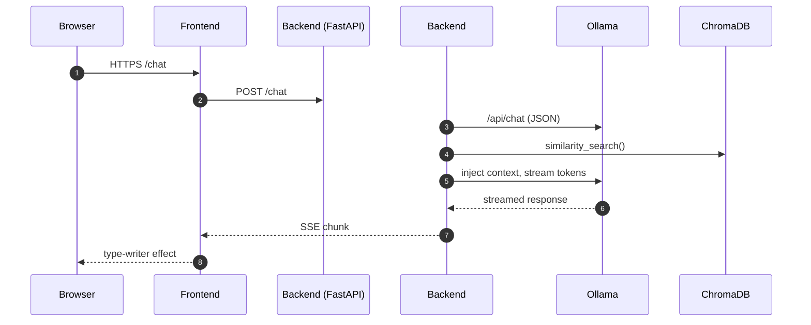

# System Architecture

---

## Components

| Layer | Tech | Responsibilities |
|-------|------|------------------|
| **Web UI** | React 18 + Chakra UI + Vite | session chat UI, model list, PDF upload |
| **API** | FastAPI, LangChain routers | `/chat`, `/doc_qa`, `/models`, `/upload` |
| **Vector store** | ChromaDB (local) | HNSW ANN + metadata filter |
| **LLM runtime** | Ollama | Hosts Llama 3 8B, embedding model, JSON API |
| **Storage** | Bind‑mount vols | `data/persist` (PDF), `data/chroma` (vectors) |

### Data Flow (Doc Ingestion)

1. **Boot script** (`app/boot.py`) walks `data/persist/*.pdf`.
2. Files not yet indexed are split (LangChain `RecursiveTextSplitter`).
3. Embeddings computed by `ollama/embedding` model via LangChain wrapper.
4. Chroma stores `text`, `embedding`, `metadata`.
5. Index persisted on disk (`data/chroma`).

### Security Notes

* Containers on a private `rag-net` bridge; only ports 443, 8000, 11434 are exposed.
* No telemetry: `CHROMA_TELEMETRY=FALSE`, LangSmith disabled.
* HTTPS terminated by Nginx in `offline-llm-frontend` (self‑signed by default).

See `docs/DEV_SETUP.md` for local debug.
